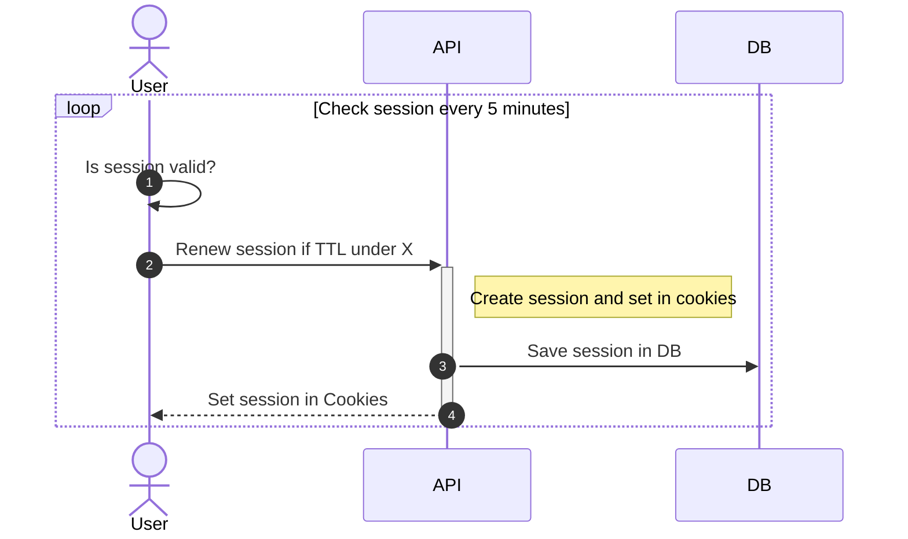
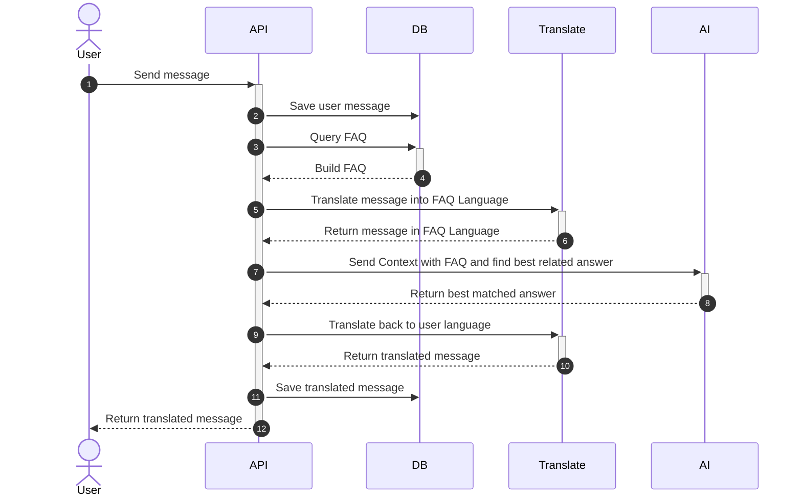

# AIFAQ Project

Use PNPM for better DX

## Pre-requisite

[Install turso CLI](https://docs.turso.tech/cli/installation)

## Dev mode

- `pnpm dev` for run dev mode
- `pnpm db:dev` for run turso DB
- `pnpm db:generate` to generate migration file when update schema
- `pnpm db:migrate` to run migration script
- `pnpm db:open` to open drizzle-studio (database GUI)

## Folder structure

```
ai-faq/
├─ app/
│  ├─ components/
│  ├─ containers/
│  ├─ core/
│  │  ├─ config/
│  │  ├─ entities/
│  │  ├─ repositories/
│  │  ├─ stores/
│  │  └─ types/
│  ├─ hook/
│  ├─ layout/
│  ├─ lib/
│  ├─ pages/
│  │  ├─ api/
│  │  │  └─ [...path].ts
│  │  ├─ chat/
│  │  │  └─ [...path].astro
│  │  └─ index.astro
│  └─ routes/
├─ migrations/
├─ public/
├─ src/
│  ├─ api/
│  ├─ config/
│  ├─ db/
│  ├─ entities/
│  ├─ interface/
│  ├─ lib/
│  ├─ middlewares/
│  ├─ repositories/
│  ├─ schema/
│  ├─ seed/
│  ├─ usecases/
│  └─ server.ts
├─ astro.config.ts
├─ drizzle.config.ts
├─ package.json
└─ tsconfig.json
```

## Diagram

### Create session



Chat


